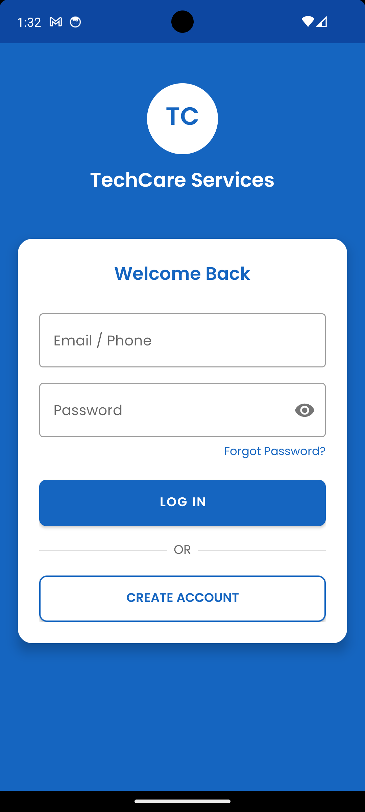
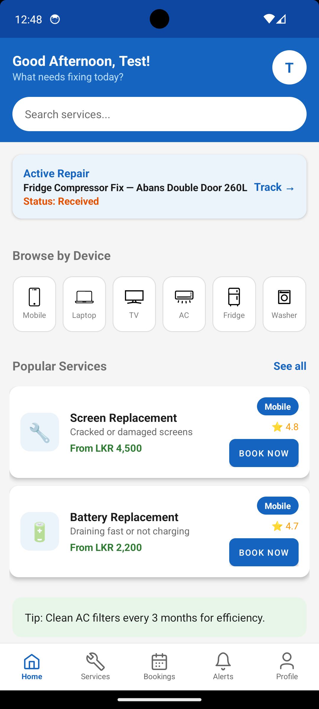
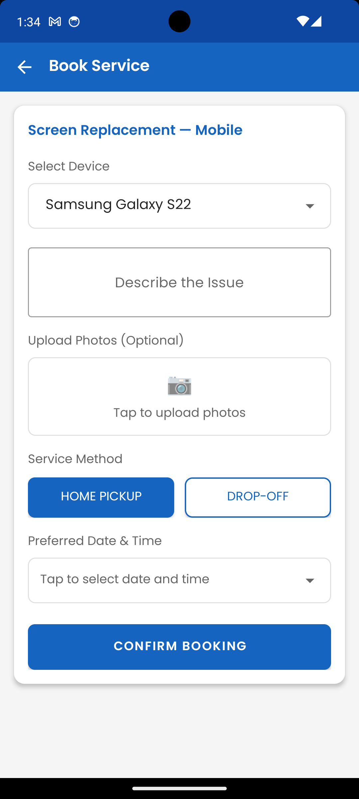
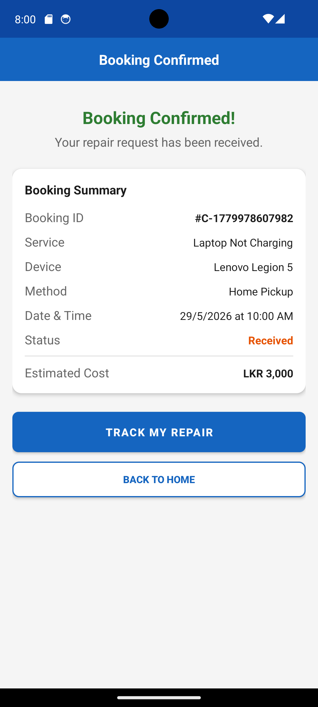
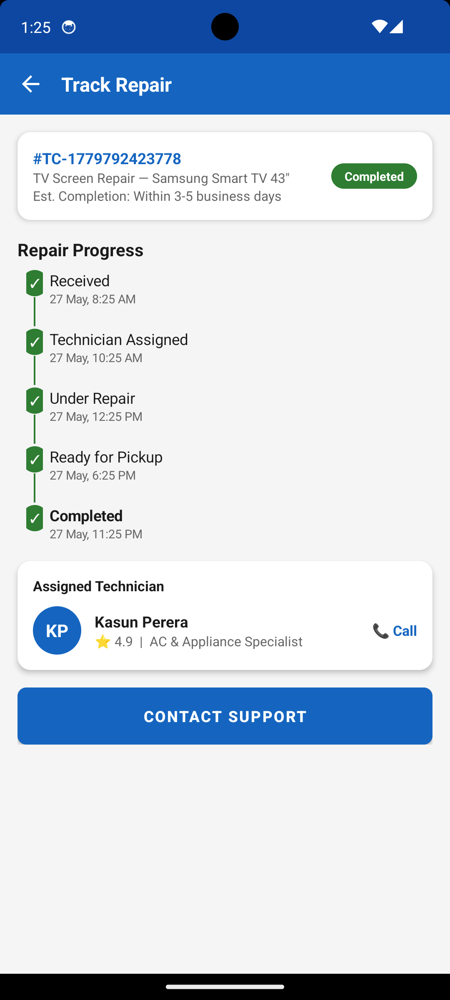
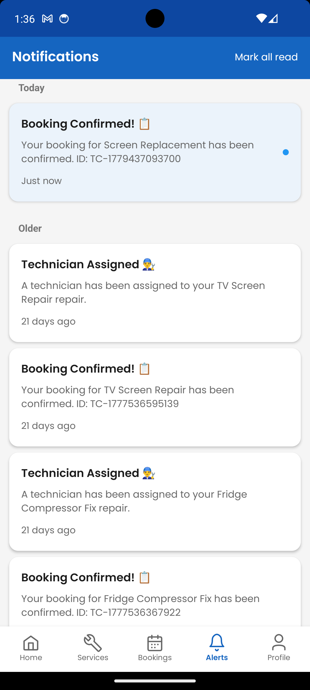
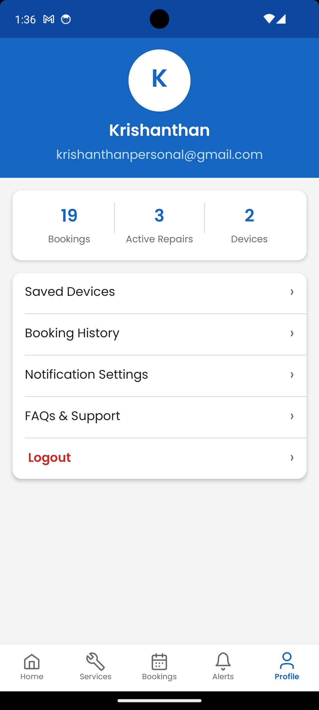

TechCare Service Management System
Overview

TechCare Service Management System is an Android-based mobile application designed to simplify electronic device repair service management. The application allows users to book repair services, track repair progress in real time, receive notifications, manage bookings, and communicate with service providers through a user-friendly interface.

This project was developed using Kotlin, Java, Firebase, and Android Studio as part of a software engineering and mobile application development project.

Features
User Authentication
User registration and login
Firebase Authentication integration
Secure session management
Service Booking
Book repair services for multiple device categories
Select preferred service methods
Home Pickup
Drop-Off Service
Upload images of damaged devices
Schedule preferred repair date and time
Repair Tracking
Real-time repair progress tracking
Repair status updates including:
Received
Technician Assigned
Under Repair
Ready for Pickup
Completed
Notifications
Instant booking confirmations
Technician assignment notifications
Repair progress updates
Read and unread notification management
User Profile Management
View booking statistics
Manage saved devices
View booking history
Update user information
Dashboard
Active repair overview
Popular service listings
Device-based service categories
Quick access to repair tracking
Technologies Used
Programming Languages
Kotlin
Java
Development Tools
Android Studio
Git
GitHub
Backend & Database
Firebase Authentication
Firebase Firestore
Firebase Storage
UI/UX Design
XML Layouts
Material Design Components
Custom Android UI Components
System Architecture

The application follows a modular Android architecture consisting of:

Authentication Module
Service Management Module
Booking Management Module
Repair Tracking Module
Notification Module
User Profile Module
Firebase Database Integration

Screenshots
## Screenshots

### Login Screen

### Home Screen

### Book Service

### Booking Confirmation

### Track Repair

### Notifications

### Profile

Installation
Clone Repository
git clone https://github.com/krishanthan-hub/TechCare-Service-Management-System.git
Open Project
Open Android Studio
Select "Open Existing Project"
Choose the cloned repository folder
Allow Gradle Sync to complete
Configure Firebase
Create a Firebase project
Enable:
Authentication
Firestore Database
Storage
Add your google-services.json file inside the app directory
Run Application
Build > Run App

Or click the Run button in Android Studio.

Future Enhancements
Online payment integration
Technician mobile application
Admin dashboard
Real-time chat support
Service rating and review system
Push notifications using Firebase Cloud Messaging
AI-powered repair recommendations
Author
Krishanthan Kumar

Full-Stack Web Developer & Android Application Developer

Skills:

Android Development
Kotlin
Java
Firebase
PHP
MySQL
React
UI/UX Design

GitHub:

https://github.com/krishanthan-hub
License

This project is developed for educational and portfolio purposes.

© 2026 Krishanthan Kumar. All rights reserved.
